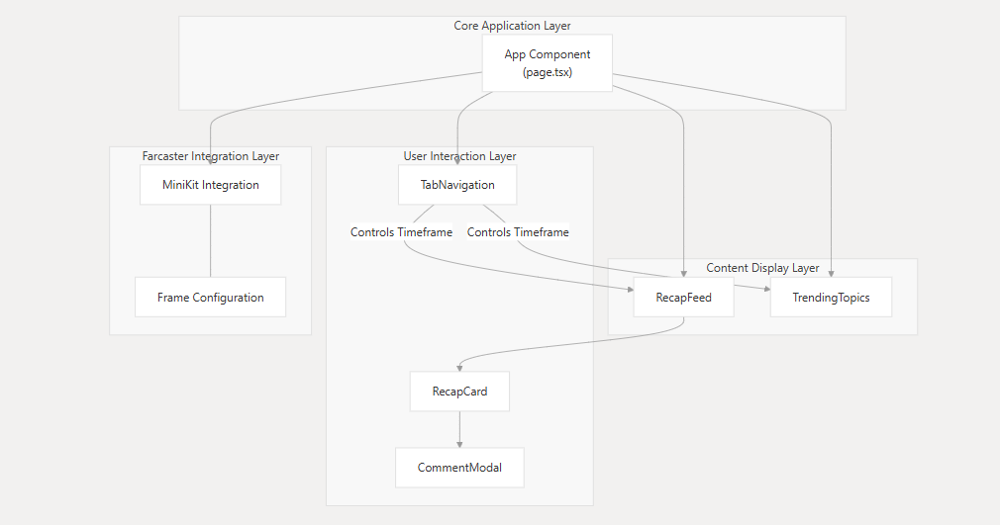
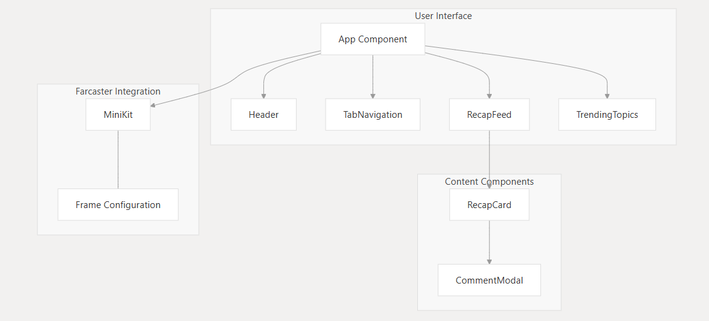
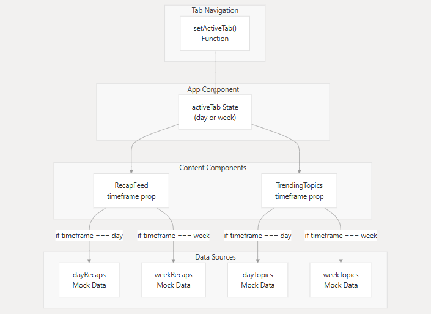
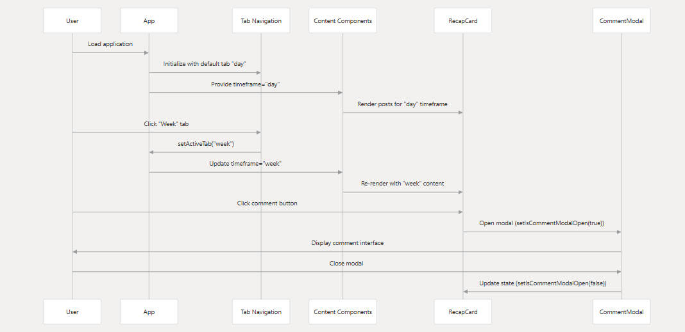
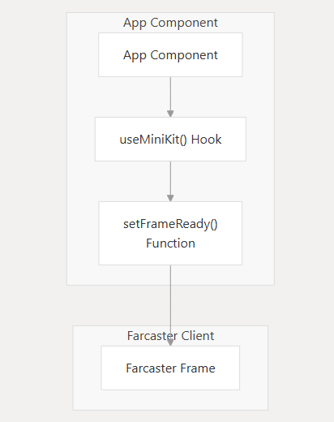
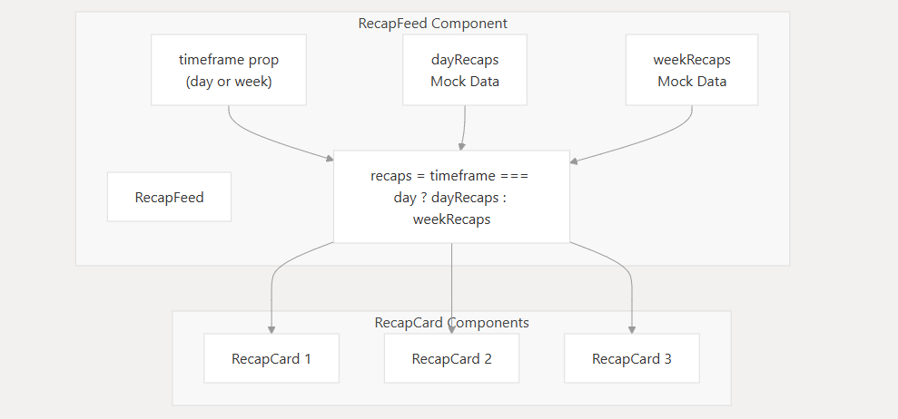
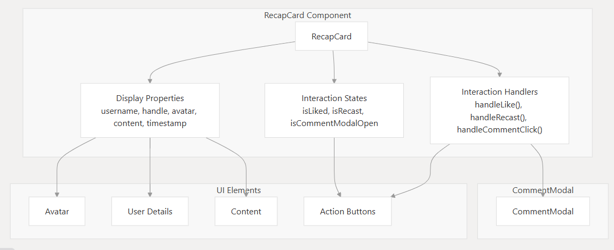

# TL.DR Application Documentation

## Overview

The TL.DR application is a Farcaster Frame application developed with Next.js. It serves as a platform to display curated social media content recaps and trending topics, offering users a quick digest of information. Key features include time-based filtering (daily or weekly views) for content, integration with the Farcaster ecosystem via OnchainKit's MiniKit, and a component-based architecture for a modular and maintainable codebase. The application aims to provide a seamless user experience for consuming summarized content within the Farcaster environment.

## Architecture & Design

This document describes the overall architecture, major components, and design patterns of the TL.DR application. It covers the high-level system design, component structure, data flow, and integration with the Farcaster protocol.

### 1. High-Level Architecture

The TL.DR application is architected with distinct layers to separate concerns and promote modularity. It leverages Next.js for the frontend framework and integrates with Farcaster as a Frame application.

**System Overview Diagram:**


*Caption: This diagram illustrates the four primary layers of the application: The Core Application Layer (managing state and Farcaster integration), the Content Display Layer (handling presentation), the User Interaction Layer (managing user engagement), and the Farcaster Integration Layer (enabling Frame functionality).*

**Core Architecture Components:**

The application follows a component-based architecture with the following key elements:

*   **Core Application Layer:** Manages the main application state (e.g., active time-filter) and integrates with Farcaster using MiniKit. The central `App Component` (page.tsx) resides here.
*   **Content Display Layer:** Responsible for the presentation of recaps and trending topics. This includes components like `RecapFeed` and `TrendingTopics`.
*   **User Interaction Layer:** Provides mechanisms for user engagement with content, such as `TabNavigation` for selecting timeframes, and interaction elements within `RecapCard` leading to `CommentModal`.
*   **Farcaster Integration Layer:** Enables the application to function as a Farcaster Frame, handling frame configuration and MiniKit integration.

*Relevant source files:*
*   `app/page.tsx` (lines 37-144)
*   `app/components/RecapFeed.tsx` (lines 6-108)
*   `app/components/RecapCard.tsx` (lines 15-108)
*   `public/.well-known/farcaster.json` (lines 1-12)

### 2. Component Architecture

The application is structured around a set of React components, each with specific responsibilities, promoting reusability and separation of concerns.

**Component Hierarchy Diagram:**


*Caption: The diagram above shows the hierarchical relationship between the main components of the application, starting from the root `App` component down to individual UI elements like `RecapCard` and `CommentModal`.*

**Main Component Details:**

| Component        | Purpose                                               | Key Properties/Responsibilities                     | State Management                                                   |
|------------------|-------------------------------------------------------|-----------------------------------------------------|--------------------------------------------------------------------|
| App              | Main application entry point, orchestrates components | `useMiniKit()`, `setFrameReady()`                   | Manages `activeTab` state (`day` or `week`) & MiniKit integration.   |
| TabNavigation    | UI for time-based filtering (Day/Week)                | `activeTab`, `setActiveTab()`                       | Receives state and update functions from the `App` component.      |
| RecapFeed        | Displays a feed of social media recaps                | `timeframe` (day/week)                              | Internally selects `dayRecaps` or `weekRecaps` (mock data).        |
| TrendingTopics   | Shows a list of popular or trending topics            | `timeframe` (day/week)                              | Internally selects `dayTopics` or `weekTopics` (mock data).          |
| RecapCard        | Renders an individual post/recap                      | Post metadata (username, content, avatar, etc.)     | Manages `isLiked`, `isRecast`, `isCommentModalOpen` local states.  |
| CommentModal     | Modal for displaying and potentially submitting comments| `isOpen`, `onClose`, `username`, `content`          | Controlled by `RecapCard`.                                         |

*Relevant source files:*
*   `app/page.tsx` (lines 37-144)
*   `app/components/RecapFeed.tsx` (lines 6-108)
*   `app/components/RecapCard.tsx` (lines 15-108)

### 3. Data Flow Architecture

State management in TL.DR primarily uses React's `useState` hook. The central piece of state, `activeTab`, dictates the content timeframe (daily or weekly) and is managed in the main `App` component.

**State Management and Data Flow Diagram:**


*Caption: This diagram illustrates how the `activeTab` state in the `App Component` controls the `timeframe` prop passed to `RecapFeed` and `TrendingTopics`, which in turn determines the data source used (e.g., `dayRecaps` vs. `weekRecaps`). The `TabNavigation` component is responsible for updating this `activeTab` state.*

*Relevant source files:*
*   `app/page.tsx` (line 44 for `activeTab` state)
*   `app/components/RecapFeed.tsx` (line 85 for timeframe logic)

**User Interaction Flow (Sequence Diagram):**


*Caption: This sequence diagram details typical user interactions, such as loading the application, switching between 'day' and 'week' tabs, and opening/closing the comment modal.*

*Relevant source files:*
*   `app/page.tsx` (lines 37-144)
*   `app/components/RecapCard.tsx` (lines 30-45 for interaction handlers)

### 4. Farcaster Integration

The application integrates with Farcaster using OnchainKit's `MiniKit` component for Frame interactions and a standard Frame configuration JSON file.

**MiniKit Integration Diagram:**


*Caption: The `App Component` utilizes the `useMiniKit()` hook and the `setFrameReady()` function to initialize and manage its state as a Farcaster Frame, interacting with the Farcaster Client.*

*Relevant source files:*
*   `app/page.tsx` (lines 37-53 for MiniKit integration)

**Frame Configuration:**

The application's Farcaster Frame is configured via `public/.well-known/farcaster.json`:
```json
{
  "frame": {
    "version": "1",
    "name": "WarpWrap",
    "iconUrl": "https://yoink.party/logo.png",
    "homeUrl": "https://warpwrap.vercel.app/",
    "imageUrl": "public/warpwrap.png",
    "buttonTitle": "Trends",
    "splashImageUrl": "public/warpwrap.png",
    "splashBackgroundColor": "#f5f0ec"
  }
}
```
*Relevant source files:*
*   `public/.well-known/farcaster.json` (lines 1-12)

### 5. Content Display System

The content display system is primarily managed by the `RecapFeed` and `RecapCard` components.

**RecapFeed Component Diagram:**


*Caption: The `RecapFeed` component receives a `timeframe` prop (either 'day' or 'week'). Based on this prop, it selects the appropriate mock data (`dayRecaps` or `weekRecaps`) and maps over this data to render multiple `RecapCard` components.*

*Relevant source files:*
*   `app/components/RecapFeed.tsx` (lines 6-108)

**RecapCard Component Diagram:**


*Caption: The `RecapCard` component is responsible for displaying individual post details (username, avatar, content, timestamp). It also manages internal states for interactions (like, recast, comment modal visibility) and includes handlers for these actions. UI elements within the card include Avatar, User Details, Content, and Action Buttons, with the CommentModal being conditionally rendered.*

*Relevant source files:*
*   `app/components/RecapCard.tsx` (lines 15-108)

### 6. Development Considerations

**Current Implementation Limitations:**

*   The application currently uses **mock data** for both recaps and trending topics.
*   User interactions (likes, recasts, comments) are tracked only in **local component state** and are not persisted.
*   The comment functionality is limited to opening a modal; **actual comment submission is not implemented**.

**Future Architecture Enhancements:**

*   Integration with **real data sources** via API endpoints to fetch dynamic content.
*   Implementation of **persistent storage** for user interactions (e.g., likes, recasts).
*   Development of **full comment functionality**, including submission and display.
*   Exploration of **server-side rendering (SSR) or static site generation (SSG) optimizations** with Next.js for improved performance and SEO.
*   Enhanced state management solution (e.g., Context API, Zustand, Redux) if application complexity grows. 